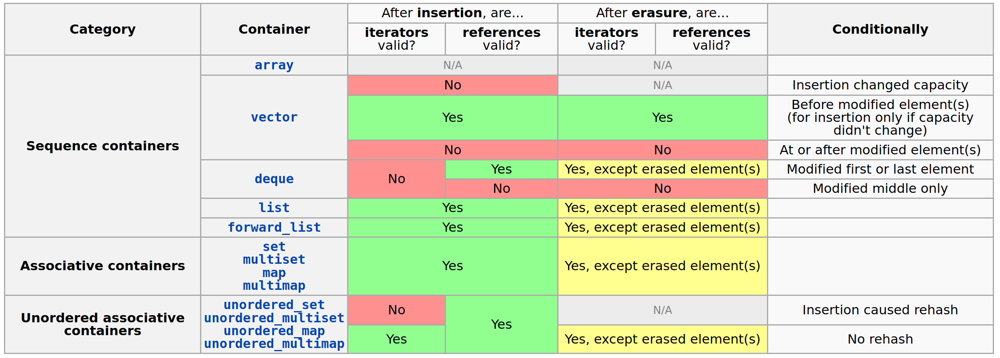

# `std::vector`
- _**Def:**_ Последовательный набор элементов
### Доступ к элементам
- `at`/`[]`: возвращает элемент по индексу (в первом случае выполняется проверка индекса). Работает за $O(1)$
- `front`/`back`. Возвращает первый/последний элемент. В случае пустого вектора - UB. Работает за $O(1)$
### Модифицирующие операции
- `insert`/`emplace`: вставка по итератору. Работает за $O(n)$ (вынуждает весь вектор подвинуться)
- `erase`: удаление по итератору: $O(n)$
- `push_back`/`emplace_back`: вставка в конец. Работает амортизированно за $O(1)$
- `pop_back`: удаление с конца. Работает за $O(1)$. Вызов от пустого вектора: UB
### Итератор
- Категория: Contiguous

# `std::deque`
- _**Def:**_ Набор элементов, который поддерживает вставку как в конец, так и в начало. Хранит элементы в "бакетах"
### Доступ к элементам
- `at`/`[]`: возвращает элемент по индексу (в первом случае выполняется проверка индекса). Работает за $O(1)$
- `front`/`back`. Возвращает первый/последний элемент. В случае пустого дека - UB. Работает за $O(1)$
### Модифицирующие операции
- `insert`/`emplace`: вставка по итератору. Работает за $O(n)$
- `erase`: удаление по итератору: $O(n)$
- `push_back`/`emplace_back`/`push_front`/`emplace_front`: вставка в конец/начало. Работает амортизированно за $O(1)$
- `pop_back`/`pop_front`: удаление с конца/начала. Работает за $O(1)$. Вызов от пустого дека: UB
### Итератор
- Категория: RandomAccess

# `std::list`
- _**Def:**_ Обычный двусвязный список
- `Node { val, *next, *prev }`
- Есть фейковая нода (`begin.prev`, `end`)
	- С этим допускается следующее:

```cpp
auto t = l.begin();
l.push_back(1);
l.push_back(2);
*(t - 2); // 1
```

_**Sol**_: создаем класс `BaseNode { *next, *prev }`, а `Node` - наследник `BaseNode` с `T value`
- По умолчанию `next` и `prev` у фейковой ноды - ссылки на саму себя

```cpp
struct List {
  private:
	struct BaseNode {
	    BaseNode* next_node;
	    BaseNode* prev_node;
	};

	struct Node: BaseNode {
	    T value;
	};

  public:
    List() {
        fake_node.next_node = &fake_node;
        fake_node.prev_node = &fake_node;
    }

    BaseNode fake_node;
}
```
### Доступ к элементам
- `front`/`back`. Возвращает первый/последний элемент. В случае пустого листа - UB. Работает за $O(1)$
### Модифицирующие операции
- `insert`/`emplace`: вставка по итератору. Работает за $O(1)$
- `erase`: удаление по итератору: $O(1)$
- `push_back`/`emplace_back`/`push_front`/`emplace_front`: вставка в конец/начало. Работает за $O(1)$
- `pop_back`/`pop_front`: удаление с конца/начала. Работает за $O(1)$
### Итератор
- Категория: BidirectionalIterator

# `std::forward_list`
- _**Def:**_ Обычный односвязный список
### Доступ к элементам
- `front`. Возвращает первый элемент. В случае пустого листа - UB. Работает за $O(1)$
### Модифицирующие операции
- `insert`/`emplace`: вставка по итератору. Работает за $O(1)$
- `erase`: удаление по итератору: $O(1)$
- `push_front`/`emplace_front`: вставка в начало. Работает за $O(1)$
- `pop_front`: удаление с начала. Работает за $O(1)$
### Итератор
- Категория: ForwardIterator

# `std::map`
- _**Def:**_ Отсортированный по ключу ассоциативный контейнер, который хранит пары ключ-значение. Внутри обычно используется красно-черное дерево поиска.

- Итератор к пустой `map`'е также можно реализовать через фейковую ноду - "самую правую"
- _**Sol**_: создаем класс `BaseNode { *left, *right, *parent }`, а `Node` - наследник `BaseNode` с `kv` и `is_red`
```cpp
template <typename Key, typename Value>
class map {
    struct BaseNode {
        Nove* left;
        Node* right;
        Node* parent;
    };

    struct Node: BaseNode {
        std::pair<const Key, Value> kv;
        bool is_red;
    };
};
```
- Тогда `begin` - это самый левый ребенок дерева, а `end` - это `fake_node`
- _**Note**_: Поскольку имеем дело с `const Key`, лучше в `range-base for`'е использовать `auto`
### Доступ к элементам
- `index[]` - доступ по ключу. Модифицрует контейнер - если значения с таким ключом не существует то создает его (кладет туда `Value()`). Работает за $O(logn)$
- `at` - доступ по ключу. Если значения с таким ключом не существует то выкидывает ошибку. Работает за $O(logn)$
- `find` - возвращает итератор на пару с нужным ключем. Если ключа нет возвращает `end()`. Работает за $O(logn)$

- `lower_bound` - возвращает итератор на первый элемент, ключ которого $>= key$
- `upper_bound` - $<= key$
### Модифицирующие операции
- `insert`/`emplace`: вставка по итератору. Работает за $O(logn)$
- `erase`: удаление по итератору: $O(logn)$
### Итератор
- Категория: BidirectionalIterator

# `std::set`
- _**Def:**_ Множество элементов. По сути это `map` без `value`

# `std::unordered_map`
- _**Def:**_ Ассоциативный контейнер, который хранит пары ключ-значение. Является хэш-таблицей
### Доступ к элементам
- `index[]` - доступ по ключу. Модифицрует контейнер - если значения с таким ключом не существует то создает его (кладет туда `Value()`). Работает за $O(1)$ (не совсем честно).
- `at` - доступ по ключу. Если значения с таким ключом не существует то выкидывает ошибку. Работает за $O(1)$ (не совсем честно).
- `find` - возвращает итератор на пару с нужным ключем. Если ключа нет возвращает `end()`. Работает за $O(1)$ (не совсем честно).
### Модифицирующие операции
- `insert`/`emplace`: вставка по итератору. Работает за $O(1)$ (не совсем честно).
- `erase`: удаление по итератору: Работает за $O(1)$ (не совсем честно).
### Итератор
- Категория: ForwardIterator

# `std::unordered_set`
- _**Def:**_ Неупорядоченное множество элементов. По сути это `unordered_map` без `value`

# `std::multimap`, `std::multiset`
- _**Def:**_ `std::unordered_map/set` с поддержкой одинаковых ключей

# Adapters
- В STL существуют так же адаптеры над контейнерами: `stack`, `queue`, `priority_queue`. Работают они довольно просто: используют методы контейнера который хранят в полях. Например, `std::stack` использует `std::deque` по умолчанию

# Инвалидация итераторов
- Доступна [здесь](https://en.cppreference.com/w/cpp/container)
- К экзу лучше выучить!


# `std::vector`
- Остановимся на некоторых важных с точки зрения восприятия методов
- Далее будет использоваться placement-new, объяснение которой будет в Memory

```cpp
template <typename T>
void Vector<T>::reserve(size_t n) {
  if (n <= capacity_) {
    return;
  }

  T* new_arr = reinterpret_cast<T*>(new int8_t[n * sizeof(T)]);
  size_t i = 0;
  try {
    for (i < size_; ++i) {
      new(new_arr + i) T(arr[i]);
    }
  } catch (...) {
    for (size_t j = 0; j < i; ++j) {
      (new_arr + j)->~T();
    }
    delete[] reinterpret_cast<int8_t*>(new_arr);
    throw;
  }

  for (size_t i = 0; i < size_; ++i) {
    (arr + i)->~T();
  }
  delete[] reinterpret_cast<int8_t*>(arr);

  arr = new_arr;
  capacity_ = n;
}
```
- Можно писать `std::uninitialized_copy(arr_, arr_ + size_, new_arr);` и избавиться от двух циклов `for` в `try-catch`

```cpp
template <typename T>
void Vector<T>::push_back(const T& value) {
  if (size_ == capacity_) {
    reserve(2 * capacity_);
  }
  new(arr + sz) T(value);
  size_ += 1;
}

// ALSO (see MoveSemantics):
template <typename T>
void Vector<T>::push_back(T&& value) {
  if (size_ == capacity_) {
    reserve(2 * capacity_);
  }
  new(arr + sz) T(std::move(value));
  size_ += 1;
}
```

```cpp
template <typename T>
void Vector<T>::pop_back(const T& value) {
  (arr + size_ - 1)->~T();
  size_ -= 1;
}
```

- Специализация под `vector<bool>`
```cpp
template <>
class Vector<bool> {
 public:
  struct BitReference {
    BitReference& operator=(bool b) {
      if (b) {
        *cell |= (1u << index);
      } else {
        *cell &= ~(1u << index);
      }
    }

    operator bool() const {
      return *cell & (1u << num);
    }

   private:
    int8_t* cell;
    uint8_t index;
  };

  BitReference operator[](size_t i) {
      return BitReference(arr_ + i / 8, i % 8);
  }

  // ...
 private:
  int8_t* arr;
  size_t size_;
  size_t capacity_;
};
```

# String
### `std::string`
- gcc realization (`data*`, `size`, `padding`, `capacity`)
- Смешная история:
	- `if (data[size_] != 0) { data[size_] = '\0'; }`
	- Это UB: read of unitialized data
	- Причем работает на 192 символах (станица памяти, физическая страница)
	- Лучше не вникать

### SSO implementation
- _**SSO**_ - is the Short / Small String Optimization
- [See more](https://stackoverflow.com/questions/10315041/meaning-of-acronym-sso-in-the-context-of-stdstring)

- Possible implementation
```cpp
class string {
public:
    // all 83 member functions
private:
    size_type m_size;
    union {
        class {
            // This is probably better designed as an array-like class
            std::unique_ptr<char[]> m_data;
            size_type m_capacity;
        } m_large;
        std::array<char, sizeof(m_large)> m_small;
    };
};
```

- На самом деле (G++)
```cpp
template <typename T>
struct basic_string {
    char* begin_;
    size_t size_;
    union {
        size_t capacity_;
        char sso_buffer[16];
    };
    // sizeof = 32; max_in-stack_string = 15
};
```

#### Clang string
- [Source](https://stackoverflow.com/questions/21694302/what-are-the-mechanics-of-short-string-optimization-in-libc)

In the short form, there are 3 words to work with:
- 1 bit goes to the long/short flag.
- 7 bits goes to the size.
- Assuming `char`, 1 byte goes to the trailing null (libc++ will always store a trailing null behind the data).

This leaves 3 words minus 2 bytes to store a short string (i.e. largest `capacity()` without an allocation).
- On a 32 bit machine, 10 chars will fit in the short string. sizeof(string) is 12.
- On a 64 bit machine, 22 chars will fit in the short string. sizeof(string) is 24..

A major design goal was to minimize `sizeof(string)`, while making the internal buffer as large as possible. The rationale is to speed move construction and move assignment. The larger the `sizeof`, the more words you have to move during a move construction or move assignment.

#### SSO benchmark on Ubuntu

#### `std::string` SSO
- [Source](https://stackoverflow.com/questions/27631065/why-does-libcs-implementation-of-stdstring-take-up-3x-memory-as-libstdc/28003328#28003328)

| Compiler         | Stack space (bytes) | Heap space (bytes) | Capacity (char8_t / bytes) |
| ---------------- | ------------------- | ------------------ | -------------------------- |
| **gcc 4.9.1**    | 8                   | 27                 | 2                          |
| **gcc 5.0.0**    | 32                  | 0                  | 15                         |
| **clang/libc++** | 24                  | 0                  | 22                         |
| **VS-2015**      | 32                  | 0                  | 15                         |

### COW
- _**COW**_ - Copy-on-write
- Подход, при котором во время чтения области данных используется общая копия, а в случае изменения данных — создается новая копия
- В стандарте COW категорически запрещена
	- В 2000-х появились гипертреды и работать со строками, в которых применяется оптимизация COW, стало очень тяжело

### FBString
- Фейсбуковская (folly FBString)
- fields order: `data`, `capacity`, `size`
- В последнем байте лежит оставшийся `capacity`
	- `Hello world!abcdefjhij\0` (`\0` все равно детерминирующий ноль)
- На самом деле не в последнем байте, а в последних 5 битах, остальные 3 бита уходят под флаги
	- `SSO/NO SSO`
- В `STL` реализация не была принята ввиду необходимости постоянно обращаться к `size` и срезать биты при обращении к `data[i]`
- Оптимизации в зависимости от размера `S`:

| S <= 23 | 23 < S < 256 | S >= 256 |
| ------- | ------------ | -------- |
| SSO     | as vector    | COW      |

# `std::tuple`
- See implementation in Misc.Tuple page

```cpp
std::tuple<int, double, std::string> tup(1, 2.2, "Hello");
```

### Get items
```cpp
std::get<0>(tup);  // get by index
std::get<double>(tup);  // get by type (get in tuple with two doubles is CE)
```

#### Cringe get
```cpp
struct Tuple {
	std::string z;
	double y;
	int x;
};

int main() {
	std::tuple<int, double, std::string> tup(1, 2.2, "Hello");
	std::cout << reinterpret_cast<Tuple&>(tup).x;  // 1 but UB
}
```

### Create tuple and unpack values
- `auto tup = std::make_tuple(0, 1.1, "world");`

```cpp
auto tup = std::make_tuple(0, 1.1, "world");  // T = int
std::tuple tup1 = {1, 2.2, "Hello"};  // deduction guide (from C++17)

int x = 37;
auto tup = std::make_tuple(x, 1.1, "world");  // T = int

// unpack
auto [x, y, z] = tup;

// std::tie - makes tuple by Args&...
int a = 37;
double b = 1.1;
std::string c = "lala";
std::tie(a, b, c) = tup;  // makes 3-linked tuple and assigns to tup
std::cout << x << ' ' << y << ' ' << z << '\n';

// std::tie - ex2
x = 10;
double y = 20;
std::string s = "a";
auto t = std::tie(x, std::ignore, s);
t = tup;
std::cout << x << '\n';
std::cout << y << '\n';
std::cout << s << '\n';
```

### Tuple cat
```cpp
std::tuple tup2 = std::tuple_cat(tup, tup1);
```

### `std::forward_as_tuple`
```cpp
template< class... Types >  
std::tuple<Types&&...> forward_as_tuple( Types&&... args ) noexcept;
```
Constructs a tuple of references to the arguments in args suitable for forwarding as an argument to a function. The tuple has rvalue reference data members when rvalues are used as arguments, and otherwise has lvalue reference data members.

# Каррирование
```cpp
#include <iostream>
#include <tuple>

template <typename F, typename... Args>
auto curry(F&& f, Args&&... args) {
  return [
    ft = std::forward_as_tuple(std::forward<F>(f)),
    argst = std::forward_as_tuple(std::forward<Args>(args)...)
  ]<typename... Ts>(Ts&&... ts) {
    return std::apply(
        std::get<0>(std::move(ft)),
        std::tuple_cat(std::move(argst), std::forward_as_tuple(std::forward<Ts>(ts)...)));
  };
}

int main() {
  int x = 10;
  auto f = [](int x, double y) { return x * y; };
  auto g = curry(f, x);
  std::cout << g(2.2) << '\n';
}
```
