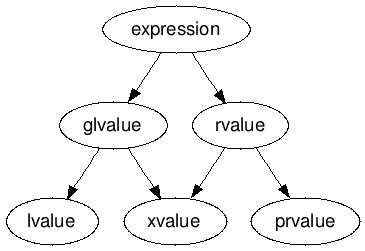

# Problem overview
- Проанализируем функцию:
```cpp
template <typename T>
void swap(T& first, T& second) {
  T tmp = first;
  first = second;
  second = tmp;
}
```

- В функции проблема - каждая из 3-х строчек - это копирование
- Или еще: метод `vector::push_back` вызывает конструктор копирования (даже если имеем дело с временным объектом)
	- `emplace_back(const Args&... args)` решает проблему, конструируя `T` на основе списка аргументов
	- Как неплохой обходной путь сойдет, но не во всех случаях
- В методе `vector::resize` осуществляется `std::unitialized_copy(...)`, а затем снова копирование
- Но мы хотим просто отдавать _право собственности_

# `std::move` overview
```cpp
template <typename T>
void swap(T& first, T& second) {
  T tmp = std::move(first);
  first = std::move(second);
  second = std::move(tmp);
}
```

- Перекладываем все ресурсы из объекта в объект, поэтому все вычисления осуществляются за `O(1)` (распростаняется, понятно, только на movable-объекты)
- То есть с помощью `std::move` мы перекладываем ресурсы
	- Однако `std::move` базовых типов (`int`, `pointer`, ...) - это просто копирование данных

- Рассмотрим `T tmp = std::move(first);`
	- Если просто написать `std::move(first)`, то ничего не произойдет
	- Все стандартные типы гарантируют, что после `auto x = std::move(y)`, `y` остается валидным (пустым наверное).

# Move-конструкторы
```cpp
String(String&& s): str_(s.str_), size_(s.size_) {
	s.str_ = nullptr;
    s.size_ = 0;
}
```
- `String(String&& s)` - конструктор с `rvalue` ссылкой на объект типа `String`
- `str_(s.str_), size_(s.size_)` - "забираем" ресурсы у донора
- `s.str_ = nullptr;` - нужно занулить указатель у себя чтобы не было двойного владения (и double free)
	- _**Напоминание:**_ `double free` - это не исключение, это RE!
- `s.size_ = 0;` - нужно оставить объект валидным и пустым

# Move `operator=`
```cpp
String& operator=(String&& s) {
  String tmp = std::move(s); // Пользуемся написанным move-конструктором
  swap(tmp); // Придется написать отдельно
  return *this;
}
```

# Автоматическая генерация и правило пяти
Move-конструктор генерируется автоматически (он будет втупую мувать все поля), если нет самого user-declared move-конструктора и:
1. Нет user-declared copy-конструкторов
2. Нет user-declared операторов присваивания копированием
3. Нет user-declared move-операторов копирования
4. Нет user-declared деструктора

- Компилятор генерирует методы, следуя ему
- С move-оператором присваивания аналогично

С выходом C++11 правило расширилось и стало называться правилом пяти. Теперь при реализации конструктора необходимо реализовать:
- Деструктор
- Конструктор копирования
- Оператор присваивания копированием
- Конструктор перемещения
- Оператор присваивания перемещением

### Define
- Обозначения: CC, CO, MC, MO, D
	- C - copy; M - move; D - destructor
	- C - constructor; O - operator
	- Лучше выучить к экзамену

| I will define | Generated automatically | Deprecated | Not generating |
| ------------- | ----------------------- | ---------- | -------------- |
| CC            | D                       | CO         | MC, MO         |
| CO            | D                       | CC         | MC, MO         |
| MO            | D                       | -          | CC, CO, MC     |
| MC            | D                       | -          | CC, CO, MO     |
| D             | CC, CO                  | -          | MO, MC         |
==TODO== fill
### Почему чаще всего automatic move-конструктор не есть хорошо
- Так сгенериуется `String(String&&)` автоматически:
```cpp
class String {
 public:
  String(String&& s) {
    s.str_ = std::move(s.str_);
    s.size_ = std::move(s.size_);
  }
 private:
  char* str_ = nullptr;
  size_t size_ = 0;
};
```

- То есть он поочередно будет мувать все поля
- `std::move` от тривиальных объектов просто их копирует. То есть мы не обнулим указатель и размер у строки `s`
- Рано или поздно произойдет `double free`

# Value categories. True lvalue, rvalue definition
- Старые определения (lvalue - что может стоять слева, rvalue - все остальное), что вводили, неверные
	- Пример в одну сторону: объект, у которого не определен оператор присваивания, не может стоять слева от `=`, хотя он lvalue
	- Пример в другую сторону: `BitReference` в `vector<bool>`. Это rvalue (временно созданный объект) однако он стоял слева от `=`

- Value-category это характеристика ВЫРАЖЕНИЯ, а не чего-либо еще


_**Def**_: lvalue - это:
1. Идентификаторы
2. Вызов функции, возвращаемый тип которой это lvalue-ссылка
3. и тд...
- Общий смысл: что-то "постоянное", у чего есть имя

_**Def**_: prvalue (pure rvalue) - это:
1. Литералы (кроме `const char*`)
	- `const char*` - lvalue, поскольку имеет постоянный адрес в секции Data
2. Вызов функции возвращаемый тип которой это non-reference
3. и тд...
- Общий смысл: что-то "временное", у чего нет имени

_**Def**_: xvalue - это:
1. Вызов функции, возвращаемый тип которой это rvalue-reference
2. и тд...
- Общий смысл: относится к мувнутым объектам (отсюда и название - expired)

==TODO== have a party: https://en.cppreference.com/w/cpp/language/value_category

# Links

### lvalue links
- `T&` is lvalue link
- lvalue-ссылку можно инициализировать только с помощью lvalue-expr
```cpp
int main() {
  int x = 0;
  int& y = x;  // y is the other name of x
  int& h = 1;  // CE
}
```

- Константную ссылку инициализировать можно даже rvalue (механизм продления жизни):
```cpp
const int& y = 1;
```

### rvalue links
- С rvalue-ссылками все наоборот: мы не можем инициализировать rvalue-ссылку с помощью rvalue
- `T&&` is rvalue link (rvalue link is lvalue expr)
- То есть следующий код не скомпилируется:
```cpp
int main() {
  int x = 0;
  int&& y = x;  // CE
}
```

- А вот такой будет работать:
```cpp
int main() {
  int&& y = 0;
}
```

- И даже такой:
```cpp
int main() {
  int x = 1;
  int&& y = 0;
  y = x;
}
```

```cpp
int main() {
  int&& x = 0;
  int&& zz = x;  // CE (x is lvalue)
  int& z = x;  // OK (x is lvalue)
}
```

- Чтобы создать rvalue-ссылку на уже существующий объект нужно воспользоваться `std::move`
	- `std::move` навешивает `&&`, переводя его в rvalue
```cpp
int main() {
  int&& x = 0;
  int&& y = std::move(x);
}
```

### Summary examples
```cpp
int x = 0;
int&& y = 1;  // продление жизни как при const&
y = x;  // здесь копия x, вызывается move и меняется временный объект () (y ссылается на свою память) (если бы было y = std::move(x), то мы бы биндили и x бы инкрементнулся)
// int& y = x; // то же самое что и int& y = static_cast<int&>(x); - нового объекта не создается, мы просто сделали ссылку (поэтому std::move не создает копию)
y += 1;
std::cout << x;
```

```cpp
#include <iostream>

int main() {
  int&& rf = 3;  // OK
  // int&& a = rf;  // CE (rf is lvalue expr)

  int&& b = std::move(rf);
  int& c = rf;  // OK (lvalue link links to lvalue expr)

  // const int&& d = rf;  // CE
  const int&& d2 = std::move(rf);  // OK
  // int&& e = std::move(d2);         // CE cast const volatile blablabla

  const int& q = std::move(d2);  // OK
}
```

| Category | Link type |
| -------- | --------- |
| lvalue   | `T&`      |
| xvalue   | `T&&`     |
| prvalue  | `T`       |
==TODO== remove this table

`T&& -> const T&`

# Универсальные ссылки и правила сжатия ссылок
### Problem overview
- Хотим реализовать `std::move`, т.е. функцию, навешивающую `&&`
- Но не умеем одновременно принимать и lvalue, и rvalue
```cpp
foo(const type& x) // принимает и то и то, но const
foo(type& x) // принимает только lvalue
foo(type&& x) // принимает только rvalue
```

### Solution-костыль
```cpp
template <typename T>
void f(T&& x) {
}
```
- В таком контексте `x` будет являться универсальной ссылкой
	- В контексте `f(T&&)` в `template<typename T> struct A` не будет
	- Нужно явно писать `template` у функции
- Цитата Мейерса: "If a variable or parameter is declared to have type `T&&` for some deduced type `T`, that variable or parameter is a universal reference."
- _**Note**_ Вместо `T` может быть любое название шаблона
- _**Note**_ Для вариадиков тоже работает
- Универсальные ссылки служат фундаментом для двух других крупных фич:
	- move-семантика
	- perfect forwarding, возможность передавать аргументы, которые являются либо lvalue, либо rvalue

### Правила сжатия ссылок (reference collapsing)
- В C++ не допускается взятие ссылки на ссылку, но такое возникакает при шаблонных подстановках
```cpp
template <typename T>
void foo(T x) {
  T& y = x;
}

int main() {
  int x = 0;
  foo<int&>(x);
}
```
- При подстановке получится `int& & y = x;`, что запрещено, потому компилятор преобразует это в просто `int&`
- До C++11 такое поведение не было стандартизированно, а вот с появлением rvalue-ссылок правило пришлось ввести.

Правило очень простое: одиночный `&` всегда побеждает. То есть:
1. `&` и `&` это `&`
2. `&&` и `&` это `&`
3. `&` и `&&` это `&`
4. `&&` и `&&` это `&&`

```cpp
template <typename SomeType>
void f(SomeType&& x) {}

int main() {
  f(5); // SomeType = int, decltype(x) = int&&

  int y = 5;
  f(y); // SomeType = int&!, decltype(x) = int&;
}
```

- _**Вывод**_: тип будет lvalue-ссылкой или rvalue-ссылкой в зависимости от типа value которое передали в функцию
- _**Note**_ `T&&` является универсальной ссылкой, только если `T` это шаблонный параметр класса. (Например в контексте `push_back` в векторе `T&& value` не является универсальной ссылкой, так как `T` это шаблонный параметр класса)
- _**Note**_ При выборе перегрузки универсальные ссылки считаются предпочтительней

# `std::move` implementation
- Эта функция умеет принимать как lvalue, так и rvalue
- Возвращать она всегда должна rvalue

```cpp
template <typename T>
std::remove_reference_t<T>&& move(T&& x) noexcept {
  return static_cast<std::remove_reference_t<T>&&>(x);
}
```
- Решили проблему с `std::swap` и `vector::push_back`
### Когда не надо писать `std::move`
- Допустим у нас есть функция `get()` которая возвращает временный объект (то есть это rvalue)
- Тогда не нужно писать `f(std::move(get()))`, можно просто написать `f(get())`

# Perfect-forwarding problem и `std::forward`
- С `push_back` разобрались
- Осталось решить проблему с `emplace_back`
```cpp
template <typename... Args>
void emplace_back(const Args&... args) {
  if (size_ == capacity_) {
    reserve(2 * capacity_);
  }
  new(arr + sz) T(args...);  // just copying args
  size_ += 1;
}
```

- Добавив `&&`, поменяем тип `args` на универсальные ссылки
- Однако написать `std::move(args)...` нельзя, так как все аргументы мувнуться, а нам нужно мувать только то что было rvalue
	- А мувать lvalue нас не просили
- Для решения этой проблемы используется `std::forward`

```cpp
template <typename... Arguments>
void emplace_back(Arguments&& args) {
  if (size_ == capacity_) {
    reserve(2 * capacity_);
  }
  new(arr + sz) T(std::forward<Arguments>(args)...);
  size_ += 1;
}
```

- _**Note:**_ шаблонный параметр надо указывать явно

### `std::forward` implementation
- Хотим принимать lvalue
- И отдавать rvalue или lvalue в зависимости от того, что было передано изначально
#### Idea 1
```cpp
template <typename T>
T&& forward(T&& value) {
    return value;
}
```

Разберем случае (`arg` и `Argument` из `emplace_back`):
1. `arg` = lvalue:
    - `Argument` = `type&`
    - `decltype(arg)` = `type&`
    - `T = type&`
    - `T&& = type&`
    - `decltype(value)` = `type&`
    - `return` = `type&`
2. `arg` = rvalue:
	- `Argument` = `type`
	- `decltype(arg)` = `type&&`
	- `T` = `type`
	- `T&&` = `type&&`
	- `decltype(value)` = `type&&` // CE
- И получилось CE так как мы принимаем rvalue а передаем lvalue

#### Idea 2
- Попробуем принимать lvalue-ref
```cpp
template <typename T>
T&& forward(T& value) {
    return value;
}
```
- Теперь пытаемся проинициализировать rvalue с помощью lvalue-ref

#### Idea 3
```cpp
template <typename T>
T&& forward(T& value) {
    return static_cast<T&&>(value);
}
```
1. `arg` = lvalue:
	- `Argument` = `type&`
	- `decltype(arg)` = `type&`
	- `T` = `type&`
	- `T&` = `type&`
	- `decltype(value)` = `type&`
	- `return` = `type&` (так как `T& &&`)
2. `arg` = `rvalue`:
	- `Argument` = `type`
	- `decltype(arg)` = `type&&`
	- `T` = `type`
	- `T&` = `type&`
	- `decltype(value)` = `type&`
	- `return` = `type&&`
- Как будто OK, но есть что добавить

#### Idea 4
1. Вставка из `type_traits` в тип по сути запрещает компилятору автоматически выводить тип (а мы хотим чтобы в `forward` тип указывали явно)
2. У `forward` на самом деле есть вторая перегрузка
	- Предположим, что форвардим не просто аргументы, а какую-то функцию от этих аргументов (`forward(bar(value))`, а в шаблонные параметры подставили тип `value`). Тогда в теории может возникнуть ситуация, когда мы пытаемся форвардить уже честное rvalue (а `forward` у нас не умеет принимать rvalue, так как принимает lvalue-ссылку)
```cpp
#include <type_traits>

template <typename T>
T&& Forward(std::remove_reference_t<T>& value) noexcept {  // we can't accept rvalue
  return static_cast<T&&>(value);
}

// forward<int&> -> int& && -> int& => int& forward(...)
// forward<int> -> int && -> int&& => int&& forward(...)

template <typename T>
T&& Forward(std::remove_reference_t<T>&& value) noexcept {
  static_assert(!std::is_lvalue_reference_v<T>);
  return static_cast<T&&>(value);
}
```

==TODO== checkout cringe
```cpp
// forward<int&>  -> int& && -> int&  int& forward();
// template <>
// const vector<int>&& forward(const vector<int>& value) {
//   return value;
// }
// template <int>
// int&& forward(int&& value) {
//   return static_cast<int&&>(value);
// }
// forward<int> -> int && -> int&&    int&& forward(...);
// const std::vector<int> v;
//
// f(T && value)
// f(std::move(v)); T -> const std::vector<int>
// f(const std::vector<int>&& value)
// forward<const std::vector<int>>(value);
// forward(const std::vector<int>&)
// forward(const std::vector<int>&&)
```

```cpp
template <typename T>
void f(T&& value) {
  Forward<T>(value);
}

int main() {
  f(10);  // T=int
  int x = 1;
  f(x);  // T=int&
}
```

# Reference qualifiers
- Работает как const-qualifier
	- Когда разделяли `operator[]` для const и non-const objects
- _**Note**_ если вообще не ставить reference qualifier, то метод будет одинаково работать для обоих видов value
```cpp
struct S {
  void f() & {
    std::cout << 1;
  }
  void f() && {
    std::cout << 2;
  }
};

int main() {
  S s;
  s.f() // 1
  std::move(s).f(); // 2
}
```

### One problem solution
- Есть у нас класс `BigInteger`. Есть для него оператор `+`. Мы хотим чтобы выражения вида `a + b = 5` не работали. До C++ 11 это решалось тем, что `operator+` возвращал `const BigInteger`. Начиная с C++11, нужно просто оператор присваивания пометить lvalue qualifier:
```cpp
struct BigInteger {
  BigInteger& opeartor=(const BigInteger&) &;
}
```

# Examples
### Example 1
- ==TODO== ?! compile - works!
```cpp
template <typename T = const char*>  // Solution: const char*&
void g(T&& value = "Hello") {  // CE. It is a lvalue: located in .text: "Hello" (we have a reference)

}

// we can: g("World"); g(); // it is OK
// const char* r = "Hello"; g("hello"); g(r)
```


==TODO== `F*CK` with it!
==TODO== `T&&` приоритетнее чем `const T&`

rvalue vs lvalue
1. 
2. если ф-ция возвращает rvalue ссылку, то ф-ция - lvalue (rvalue) expr
